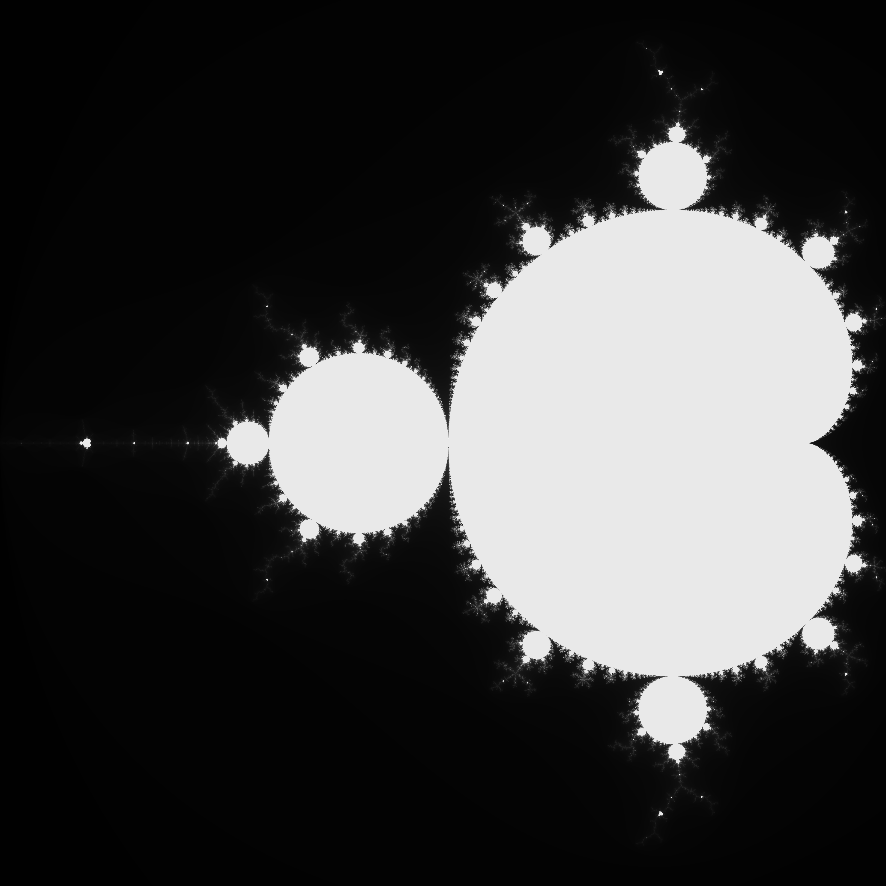

# mandelbrot
Mandelbrot fractal research repo

## Why?
I've refactored this piece of code like 6140275936420759697 times so here's the collection of all those efforts.

## How?
The C directory has everything you need for a 100% portable version to generate on whatever piece of hardware you want.
nobuild courtesy of tsoding at:
 - [nobuild](https://github.com/tsoding/nobuild)

The c++ directory has three sub directories.
`mandelbrot/` has my first c port from:
 - [The Coding Train](https://www.youtube.com/watch?v=6z7GQewK-Ks)
`mandelbrot-gamma/` using openmp for multithreading; a very optimized version of that same code
`mandelbrot-lambda/` is in the works but it's supposed to be the same as mandelbrot-gamma but using lambdas

## Here it is:

## TODO():
    - histogram
    - fancy colors
    - specify spot to generate in
    - maybe animate ??
