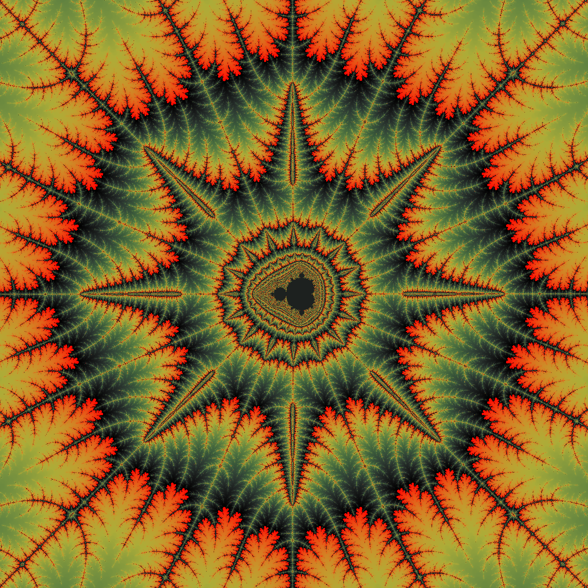

# mandelbrot
Mandelbrot fractal research repo

## Why?
I've refactored this piece of code like 6140275936420759697 times so here's the collection of all those efforts.

## How?
The C directory has everything you need for a 100% portable version to generate on whatever piece of hardware you want.

The c++ directory has three sub directories.

`mandelbrot/` has my first c port from:
 - [The Coding Train](https://www.youtube.com/watch?v=6z7GQewK-Ks)
 
`mandelbrot-gamma/` using openmp for multithreading; a very optimized version of that same code

`mandelbrot-lambda/` ~~is in the works but it's supposed to be the same as mandelbrot-gamma but using lambdas~~ I will probably remove this further on since mandelbrot-gamma has proven to be the way forward for this project.

## Here it is:

## TODO():
 - [x]  histogram coloring
 - [x]  fancy colors
 - [x] specify spot to generate in
   - even has zoom now
 - [ ] animate
